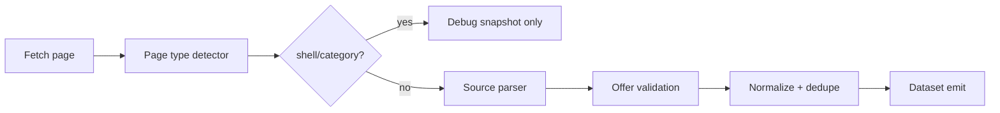

# KanzPay Crawler

UAE offer crawler optimized for **approved sources**, not raw URL volume. The crawler classifies pages, extracts merchant-level offers with source-specific parsers, validates before emit, and retries JS-heavy pages with Playwright.

## Layout

```
src/
  sources/          Registry, policy, crawl target selection
  parsers/          ENBD, Visa, FAB, generic-offer parsers
  extraction/       Page typing, render waits, orchestration
  validation/       Offer + source quality rules
  discovery/        Enqueue rules and link filtering
  jobs/             Offline crawl plan + health checks
fixtures/           Real HTML samples for parser tests
tests/              Parser quality tests (node --test)
```

## Source strategy

| Source | Status | Parser | Notes |
|--------|--------|--------|-------|
| Emirates NBD | approved | `enbd.parser.js` | Listing + detail; excludes `/campaigns/` |
| Visa UAE | probation | `visa.parser.js` | Listing-first; skips generic detail shells |
| FAB | probation | `fab.parser.js` | Filters category headers (`Seasonal Offers`, etc.) |
| Google discovery | rejected | — | Keep disabled locally; use scheduled runs only |

Sources are loaded from:

1. Actor `input.sourceRegistry` (optional)
2. `storage/key_value_stores/default/INPUT.registry.json` (from backend `npm run crawl-plan`)
3. Built-in `DEFAULT_SOURCES` in `source-registry.js`

Set `useSourceRegistry: false` to pass manual `startUrls`.

## Pipeline



### Page types

- `listing` — multiple offer cards
- `detail` — single merchant offer
- `category` — section headers only (skipped)
- `shell` — JS shell / sparse body (retry with Playwright or skip)
- `error` — 404 / oops pages
- `unknown` — fallback parsing

### Render strategy

1. Cheerio fetch first (fast path)
2. Promote to Playwright when selectors missing or page typed as `shell`
3. Per-source wait selectors in `extraction/selector-fallbacks.js`
4. Visa waits for `.vs-card` count or `%` in body text

### Output fields

Each emitted offer includes:

- `sourceUrl`, `sourceType`, `parserName`, `parserVersion`
- `pageType`, `confidence`, `extractionWarnings`
- Standard offer fields (`merchantName`, `offerTitle`, `discountType`, etc.)

Invalid pages produce **no dataset rows**; debug snapshots record `pageType`, `skippedOffers`, and reasons.

## Commands

```bash
# Parser smoke tests (inline samples)
npm run test:parsers

# Fixture-based quality tests
npm run test:quality

# All tests
npm test

# Build Apify INPUT from registry
node src/jobs/crawl-approved-sources.job.js

# Offline health report from fixtures
node src/jobs/sample-source-health.job.js
```

## Adding a new parser

1. Create `src/parsers/mybank.parser.js` with `matchMybank(url)` and `parseMybank($, url, rawText, rawHtml, meta)` returning `{ offers, warnings }`.
2. Register in `src/parsers/index.js` **before** generic fallback.
3. Add selectors to `src/extraction/selector-fallbacks.js`.
4. Add enqueue rules in `src/discovery/enqueue-rules.js` if needed.
5. Add a source entry to `DEFAULT_SOURCES` or backend source registry.
6. Add HTML fixture + test case in `fixtures/` and `tests/parser-quality.test.js`.

## Quality metrics (per run)

Tracked in `RUN_SUMMARY.qualityBySource`:

- **pages** — pages processed per source
- **offersEmitted** — rows pushed to dataset
- **skippedShell** / **skippedCategory** / **skippedValidation** — noise filtered pre-ingestion

## Acceptance checklist

- ENBD listing/detail paths unchanged; campaigns excluded
- Visa listing cards extracted; generic detail shells skipped
- FAB category headers not emitted as offers
- Shell pages filtered before ingestion
- Probation sources use stricter validation (`strictQualityGate`)
