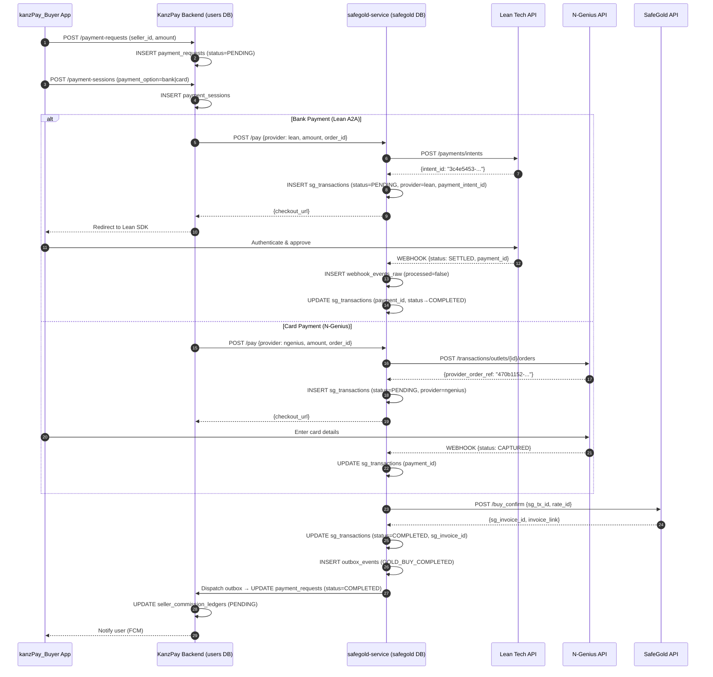

# KanzPay & SafeGold — Full Database Extract & Relationship Map
**Generated:** 2026-06-24 | **For:** AI Developer Analysis
**Databases Covered:** KanzPay App DB • Users DB • SafeGold Service DB

---

## Database Overview & Architecture

> [!IMPORTANT]
> There are **3 separate PostgreSQL databases** across 2 Supabase projects. They are linked logically by `user_id` / `app_user_id` — **no cross-DB foreign keys exist**.

| DB Name | Supabase Project | What it stores |
|---|---|---|
| **KanzPay App DB** | `lxrmryqduielvbyypeiy` | Seller business data, auto-gold, commission ledgers, POS |
| **Users DB** | `ariegorjlfenlzelwjsb` | Users, KYC, payment sessions, payment requests, payment methods |
| **SafeGold DB** | `ariegorjlfenlzelwjsb` (schema: `safegold`) | Gold transactions, deliveries, bank accounts, webhooks, outbox |

---

## Master Relationship Map

```mermaid
erDiagram
    %% ─── USERS DB ──────────────────────────────────────────
    USERS {
        uuid id PK
        text phone UK
        text email
        text full_name
        text user_type "BUYER | SELLER"
        text[] associated_with
        text preferred_payment_gateway "bank | card"
        bool is_phone_verified
        text created_from
    }
    
    USERS ||--o| BUYER_KYC_VERIFICATIONS : "1-to-1 via user_id"
    USERS ||--o| SELLER_KYC_VERIFICATIONS : "1-to-1 via user_id"
    USERS ||--o{ USER_PAYMENT_METHODS : "user_id"
    USERS ||--o{ PAYMENT_REQUESTS : "buyer_user_id"
    USERS ||--o{ PAYMENT_SESSIONS : "user_id"
    USERS ||--o{ SPLIT_PAYMENT_GROUPS : "buyer_user_id"
    USERS ||--o{ DEVICE_SESSIONS : "user_id"
    USERS ||--o{ NOTIFICATIONS : "user_id"

    BUYER_KYC_VERIFICATIONS {
        uuid id PK
        uuid user_id FK
        enum status "not_started|in_progress|pending_review|verified|rejected"
        text emirates_id_front_key
        text emirates_id_back_key
        text passport_front_key
        text face_selfie_key
        jsonb extracted_data
        numeric face_match_score
        numeric name_match_score
        text safegold_identity_number
    }
    
    SELLER_KYC_VERIFICATIONS {
        uuid id PK
        uuid user_id FK
        enum status
        text emirates_id_front_key
        jsonb extracted_data
        jsonb business_documents_verification
        numeric face_match_score
        text safegold_identity_number
    }

    USER_PAYMENT_METHODS {
        uuid id PK
        uuid user_id FK
        text type "bank | card"
        text provider "lean | ngenius"
        jsonb provider_data
        bool is_default
    }

    PAYMENT_REQUESTS {
        uuid id PK
        uuid seller_user_id FK
        uuid buyer_user_id FK
        numeric amount_aed
        text status
        text payment_option "bank | card | split"
        uuid payment_session_id FK
        text note
    }

    PAYMENT_SESSIONS {
        uuid id PK
        uuid user_id FK
        uuid payment_request_id FK
        text provider "lean | ngenius | tryspare"
        text gateway_session_id
        text status
        jsonb gateway_payload
    }

    SPLIT_PAYMENT_GROUPS {
        uuid id PK
        uuid payment_request_id FK
        uuid buyer_user_id FK
        int split_count
        numeric amount_per_split
    }

    %% ─── KANZPAY APP DB ────────────────────────────────────
    SELLER_PROFILES {
        uuid id PK
        uuid user_id UK "logical FK to USERS.id"
        text business_name
        text trade_license_number
        text iban
        text bank_name
        jsonb bank_details
        jsonb kyc_documents
        enum status "DRAFT|PENDING_VERIFICATION|APPROVED"
        enum commercial_plan_tier "BASIC|PREMIUM|PLATINUM"
    }

    SELLER_PROFILES ||--o{ SELLER_STORES : "user_id"
    SELLER_PROFILES ||--o{ SELLER_AUTO_GOLD_SETTINGS : "seller_profile_id"
    SELLER_PROFILES ||--o{ SELLER_AUTO_GOLD_HISTORY : "seller_profile_id"
    SELLER_PROFILES ||--o{ SELLER_COMMISSION_LEDGERS : "seller_profile_id"

    SELLER_STORES {
        uuid id PK
        uuid seller_user_id FK
        text name
        numeric latitude
        numeric longitude
        text formatted_address
    }

    SELLER_POS {
        uuid id PK
        uuid seller_user_id FK
        uuid store_id FK
        text name
        text description
    }

    SELLER_AUTO_GOLD_SETTINGS {
        uuid id PK
        uuid seller_profile_id FK
        bool is_enabled
        numeric diversion_percentage "1-100%"
        numeric minimum_purchase_aed
        enum frequency "DAILY | WEEKLY | MONTHLY"
    }

    SELLER_AUTO_GOLD_HISTORY {
        uuid id PK
        uuid seller_profile_id FK
        timestamp period_start
        timestamp period_end
        numeric total_net_sales_aed
        numeric diversion_percentage
        numeric gold_purchase_amount_aed
        text safegold_order_id
        enum status "PENDING | COMPLETED | FAILED"
    }

    SELLER_COMMISSION_LEDGERS {
        uuid id PK
        uuid seller_profile_id FK
        uuid origin_payment_request_id FK
        numeric commission_amount
        numeric commission_percentage
        text payment_option "bank | card"
        enum status "PENDING | SETTLED"
    }

    %% ─── SAFEGOLD DB (schema: safegold) ───────────────────
    SG_USERS {
        text app_user_id PK "= USERS.id"
        text sg_identity_number "Emirates ID No"
        text app_source "KANZPAY_BUYER | KANZPAY_SELLER"
        text kyc_status
        text lean_customer_id
        text lean_destination_id
        numeric gold_balance
        numeric sellable_balance
        numeric invested_value
    }

    SG_TRANSACTIONS {
        uuid id PK
        text app_user_id FK
        text app_source
        enum type "BUY | SELL"
        enum status "PENDING | COMPLETED | FAILED | PENDING_PAYOUT"
        text order_id
        int sg_tx_id
        text sg_invoice_id
        numeric gold_amount "precision 18,8"
        bigint aed_amount_minor "in fils"
        numeric rate
        text rate_id
        text provider "lean | ngenius | tryspare"
        text payment_intent_id
        text payment_id
        text payout_id
        text provider_order_ref
    }

    SG_USERS ||--o{ SG_TRANSACTIONS : "app_user_id"
    SG_USERS ||--o{ VERIFIED_BANK_ACCOUNTS : "app_user_id"
    SG_USERS ||--o{ SG_DELIVERIES : "app_user_id"

    VERIFIED_BANK_ACCOUNTS {
        uuid id PK
        text app_user_id FK
        text provider "lean"
        text customer_id
        text destination_id
        timestamp verified_at
    }

    SG_DELIVERIES {
        uuid id PK
        text app_user_id FK
        text sg_delivery_id
        numeric gold_amount
        text status
        jsonb delivery_address
        text tracking_number
    }

    WEBHOOK_EVENTS_RAW {
        uuid id PK
        text provider "lean | ngenius | safegold"
        text event_id UK
        jsonb payload
        jsonb headers
        bool processed
        text error
    }

    OUTBOX_EVENTS {
        uuid id PK
        text event_type
        jsonb payload
        bool dispatched
    }

    PENDING_GOLD_GIFTS {
        uuid id PK
        text sender_app_user_id FK
        text recipient_app_user_id FK
        numeric gold_amount
        text status
    }
```



---

## Table-by-Table Data Reference

### DATABASE 1: Users DB

---

#### Table: `users`
**Description:** Single source of truth for all user identities (Buyers and Sellers).

| Field | Type | Example | Notes |
|---|---|---|---|
| `id` | uuid PK | `8676d4df-5a1a-4922-96a2-64ce5e2c4c14` | Used as `user_id` everywhere |
| `email` | text | `user2@example.com` | Can be null (phone-first) |
| `phone` | text | `+966501234568` | Always present |
| `full_name` | text | `Ahmed Al-Mansoori` | Used for KYC name-matching |
| `user_type` | enum | `SELLER` | `BUYER` or `SELLER` |
| `associated_with` | text[] | `["kanzpay-buyer-ios"]` | Which apps this user has used |
| `preferred_payment_gateway` | text | `bank` | `bank` (Lean A2A) or `card` (N-Genius) |
| `is_phone_verified` | bool | `true` | OTP verified |
| `created_from` | text | `kanzpay-buyer-ios` | Source app |

**Sample Rows:**
```json
[
  {
    "id": "8676d4df-5a1a-4922-96a2-64ce5e2c4c14",
    "email": "user2@example.com",
    "phone": "+966501234568",
    "full_name": "Ahmed Al-Mansoori",
    "user_type": "SELLER",
    "associated_with": ["kanzpay-buyer-ios"],
    "preferred_payment_gateway": "bank",
    "is_phone_verified": true,
    "created_from": "kanzpay-buyer-ios",
    "created_at": "2026-05-14T13:05:33.518Z"
  }
]
```

---

#### Table: `seller_kyc_verifications`
**Description:** Stores the AI-powered identity and business document verification for sellers. Uses OpenAI GPT-4o Vision for OCR and face matching.

| Field | Type | Example | Notes |
|---|---|---|---|
| `id` | uuid PK | `00e42170-93ce...` | |
| `user_id` | uuid FK | links to `users.id` | 1:1 relationship |
| `status` | enum | `verified` | `not_started`, `in_progress`, `pending_review`, `verified`, `rejected` |
| `emirates_id_front_key` | text | `kyc/{user_id}/...png` | S3 storage key |
| `emirates_id_back_key` | text | `kyc/{user_id}/...png` | S3 storage key |
| `face_selfie_key` | text | `kyc/{user_id}/...jpg` | S3 storage key |
| `extracted_data` | jsonb | See below | OpenAI OCR result |
| `face_match_score` | numeric | `0.8500` | 0.55 threshold |
| `face_match_passed` | text | `true` | |
| `name_match_score` | numeric | `1.0000` | Fuzzy match vs profile name |
| `name_match_passed` | text | `true` | |
| `business_documents_verification` | jsonb | See below | VAT + Trade License AI check |
| `rejection_reason` | text | `"Emirates ID name does not match..."` | Human-readable |
| `safegold_identity_number` | text | `874-9891-3838262-3` | Emirates ID number, synced to SafeGold |
| `safegold_sync_error` | text | null | Error if SafeGold registration fails |
| `safegold_synced_at` | timestamp | `2026-06-03T15:32:18Z` | |

**`extracted_data` structure:**
```json
{
  "work": {
    "employer": "Engineering Techniques Services L",
    "occupation": "Pesticides Worker"
  },
  "identity": {
    "cardNo": "122809200",
    "expiryDate": "09/06/2040",
    "issuingDate": "10/06/2022",
    "emiratesIdNo": "874-9891-3838262-3",
    "issuingPlace": "Dubai"
  },
  "personal": {
    "gender": "M",
    "fullName": "test seller",
    "dateOfBirth": "03/01/1989",
    "nationality": "Pakistan"
  },
  "provider": "openai",
  "confidence": 0.9
}
```

**`business_documents_verification` structure:**
```json
{
  "vat": {
    "trn": "100056843300003",
    "kind": "vat_certificate",
    "valid": true,
    "legalName": "test business name",
    "issueDate": "13/01/2019",
    "validityStatus": "valid"
  },
  "commercialLicense": {
    "licenseNumber": "CN-3637812",
    "tradeName": "test business name",
    "valid": true,
    "issueDate": "17/07/2023",
    "expiryDate": "26/07/2030",
    "legalRepresentatives": ["test seller"]
  },
  "businessNameMatch": { "score": 1, "passed": true },
  "addressMatch": { "score": 1, "passed": true, "skipped": true },
  "legalRepresentativeMatch": { "score": 1, "passed": true },
  "checkedAt": "2026-06-03T15:30:52.256Z"
}
```

**REJECTED example (name mismatch):**
```json
{
  "id": "7285e127-13c6-4833-880d-e7f0f3cb4d40",
  "user_id": "2fb24f98-7269-488d-adb8-a879e32a4725",
  "status": "rejected",
  "name_match_score": "0.0000",
  "name_match_passed": "false",
  "profile_name_snapshot": "Test Seller",
  "rejection_reason": "The name on your Emirates ID (Rahul Sharma) does not match your account name (Test Seller).",
  "safegold_identity_number": null,
  "safegold_synced_at": null
}
```

---

#### Table: `buyer_kyc_verifications`
**Description:** Identity verification for buyers. Same structure as seller KYC but without business documents. Also accepts Passport in addition to Emirates ID.

| Field | Type | Notes |
|---|---|---|
| `passport_front_key` | text | Buyer-only field (sellers don't need passport) |
| `safegold_identity_number` | text | Set on verification success, used to sync buyer to SafeGold |

**Sample — Verified buyer:**
```json
{
  "id": "359addc0-0c3f-4442-a4fa-113b067a9f82",
  "user_id": "a1698361-af4c-44e3-abff-f06b43721320",
  "status": "in_progress",
  "emirates_id_front_key": "kyc/a1698361.../emiratesIdFront-....png",
  "extracted_data": {
    "identity": { "emiratesIdNo": "784-1989-8383262-1" },
    "personal": { "fullName": "test seller", "dateOfBirth": "03/01/1989" },
    "provider": "openai",
    "confidence": 0.9
  },
  "face_match_score": null,
  "name_match_score": "1.0000",
  "safegold_identity_number": null
}
```

---

#### Table: `payment_requests`
**Description:** The core transaction initiation record. Created when a buyer initiates payment to a seller.

**Sample Rows:**
```json
[
  {
    "id": "8b955b55-7aba-4b1d-bb6d-5a1f1d1ed358",
    "seller_user_id": "...",
    "buyer_user_id": "...",
    "amount_aed": "255.00",
    "payment_option": "card",
    "status": "PENDING",
    "note": "For services",
    "pos_id": "...",
    "store_id": "..."
  },
  {
    "id": "cd5ef1b5-bee9-4743-82b2-93e6ccbc682a",
    "payment_option": "bank",
    "amount_aed": "100.00",
    "status": "COMPLETED"
  }
]
```

---

#### Table: `payment_sessions`
**Description:** Per-gateway checkout session. Created when the buyer chooses payment method. Links the KanzPay `payment_request` to the gateway session (Lean intent / N-Genius order).

| Field | Notes |
|---|---|
| `provider` | `lean`, `ngenius`, or `tryspare` |
| `gateway_session_id` | Lean intent ID or N-Genius order ID |
| `gateway_payload` | Full raw response from the gateway |
| `status` | `CREATED → PROCESSING → COMPLETED / FAILED` |

---

#### Table: `user_payment_methods`
**Description:** Saved payment methods. Linked from Lean verified bank accounts and N-Genius tokenized cards.

**Sample Rows (20 records fetched):**
```json
[
  {
    "id": "...",
    "user_id": "53f844c8-7446-4de0-a71a-cffad89a69c2",
    "type": "bank",
    "provider": "lean",
    "provider_data": {
      "customerId": "7d89c0a9-b1ef-41e5-b779-542c4d8dc117",
      "destinationId": "4d766ed9-7b6d-4a54-9214-0479e0b74076",
      "bankName": "Emirates NBD",
      "accountType": "BUSINESS"
    },
    "is_default": true
  }
]
```

---

#### Table: `split_payment_groups`
**Description:** Groups multiple buyers for a split payment against one `payment_request`.

| Field | Notes |
|---|---|
| `payment_request_id` | Parent payment request |
| `buyer_user_id` | Each buyer in the split |
| `split_count` | Total number of splits |
| `amount_per_split` | Amount each buyer owes |

---

### DATABASE 2: KanzPay App DB

---

#### Table: `seller_profiles`
**Description:** Core seller business profile. Logical link to `users.id` (no DB-level FK).

**Sample Rows (trimmed for readability):**
```json
[
  {
    "id": "0dc820ce-8236-4414-bff1-c4a8aa24b071",
    "user_id": "53f844c8-7446-4de0-a71a-cffad89a69c2",
    "business_name": "Test Business Name",
    "trade_license_number": "TL000004778",
    "iban": "AE620030012285049920001",
    "bank_name": "Emirates NBD",
    "bank_account_type": "BUSINESS",
    "bank_country_code": "AE",
    "status": "APPROVED",
    "commercial_plan_tier": "PREMIUM",
    "commercial_plan_price_aed": "99.00",
    "commercial_plan_buy_date": "2026-06-24T06:00:18Z",
    "commercial_plan_next_due_date": "2026-07-24T06:00:18Z",
    "latitude": "25.2081603",
    "longitude": "55.2667417",
    "formatted_address": "63 Al Safa St - Al Satwa - Dubai",
    "bank_details": {
      "appSource": "kanzappSeller",
      "appUserId": "53f844c8-7446-4de0-a71a-cffad89a69c2",
      "accountType": "BUSINESS",
      "countryCode": "AE",
      "verifiedAt": "2026-06-24T05:07:21.577Z",
      "customerDetails": {
        "email": "seller141@gmail.com",
        "phone": "+971564894566",
        "firstName": "Rahul",
        "lastName": "Sharma"
      },
      "identifications": [{ "type": "TRADE_LICENCE", "value": "TL000004778" }],
      "verificationResponse": { "status": "VERIFIED" }
    }
  },
  {
    "id": "7fe08aac-f582-4a30-9f83-a8466f12258b",
    "user_id": "0d4e9980-d1c1-4c45-ab2c-ba7fc3e12d1c",
    "status": "DRAFT",
    "commercial_plan_tier": null,
    "iban": "AE620030012285049920001",
    "bank_details": { "verificationResponse": { "status": "VERIFIED" } }
  },
  {
    "id": "7dda69cb-b93d-49eb-af26-814a21bb1652",
    "user_id": "0ee32abd-b304-4c1a-9074-3bbcae0a5bad",
    "status": "APPROVED",
    "commercial_plan_tier": "PLATINUM"
  }
]
```

---

#### Table: `seller_pos`
**Description:** Physical Point-of-Sale terminals under a seller store.

**Sample Rows:**
```json
[
  { "id": "552614c2-859e-45da-a4a8-a5a40c86fb22", "seller_user_id": "53f844c8-...", "store_id": "0f684c5e-...", "name": "pppp", "created_at": "2026-06-24T06:15:27Z" },
  { "id": "4b94f080-1bc8-4695-92ca-d53693e8dc0a", "seller_user_id": "a948a624-...", "store_id": "3e7b6c98-...", "name": "POS3" },
  { "id": "fcf5a8fd-8ad7-4a0e-8806-7523cc7fa83d", "seller_user_id": "a948a624-...", "store_id": "3e7b6c98-...", "name": "POS1" }
]
```

---

#### Table: `seller_stores`
**Description:** Physical store locations under a seller.

---

#### Table: `seller_auto_gold_settings`
**Description:** Auto-gold configuration — what % of daily/weekly/monthly net sales should be auto-purchased as gold.

**All 10 records:**
```json
[
  { "seller_profile_id": "71de7e5d-...", "is_enabled": true,  "diversion_percentage": "25.00", "frequency": "DAILY",   "minimum_purchase_aed": "1.00"  },
  { "seller_profile_id": "60691eb6-...", "is_enabled": false, "diversion_percentage": "50.00", "frequency": "WEEKLY",  "minimum_purchase_aed": "15.00" },
  { "seller_profile_id": "22e9ee3d-...", "is_enabled": true,  "diversion_percentage": "10.00", "frequency": "DAILY",   "minimum_purchase_aed": "10.00" },
  { "seller_profile_id": "7e48cdbd-...", "is_enabled": false, "diversion_percentage": "7.00",  "frequency": "DAILY",   "minimum_purchase_aed": "10.00" },
  { "seller_profile_id": "fa2aee96-...", "is_enabled": true,  "diversion_percentage": "10.00", "frequency": "DAILY",   "minimum_purchase_aed": "10.00" },
  { "seller_profile_id": "1ab2ef47-...", "is_enabled": false, "diversion_percentage": "1.00",  "frequency": "DAILY",   "minimum_purchase_aed": "10.00" },
  { "seller_profile_id": "1f1272bd-...", "is_enabled": true,  "diversion_percentage": "23.00", "frequency": "MONTHLY", "minimum_purchase_aed": "1.00"  },
  { "seller_profile_id": "471a4535-...", "is_enabled": true,  "diversion_percentage": "1.00",  "frequency": "MONTHLY", "minimum_purchase_aed": "5.00"  },
  { "seller_profile_id": "7f5e8286-...", "is_enabled": true,  "diversion_percentage": "40.00", "frequency": "DAILY",   "minimum_purchase_aed": "10.00" },
  { "seller_profile_id": "2eda8ae3-...", "is_enabled": false, "diversion_percentage": "15.00", "frequency": "DAILY",   "minimum_purchase_aed": "10.00" }
]
```

---

#### Table: `seller_auto_gold_history`
**Description:** Historical log of each auto-gold execution (daily/weekly cron). Maps directly to a SafeGold order ID.

**Key Linkage:** `safegold_order_id` → `sg_transactions.order_id` in SafeGold DB

**Sample Rows (20 records, showing key patterns):**
```json
[
  {
    "id": "33cb575d-876c-49bd-89e9-b44230ca2500",
    "seller_profile_id": "7f5e8286-f55d-4e94-8f57-aee055bd66c1",
    "period_start": "2026-06-22",
    "period_end": "2026-06-23",
    "total_net_sales_aed": "4093.20",
    "diversion_percentage": "40.00",
    "gold_purchase_amount_aed": "1637.28",
    "safegold_order_id": "25493",
    "status": "COMPLETED"
  },
  {
    "id": "af78b63d-5a67-4da0-a538-d2b7af9a1984",
    "seller_profile_id": "7f5e8286-f55d-4e94-8f57-aee055bd66c1",
    "period_start": "2026-06-22",
    "period_end": "2026-06-23",
    "total_net_sales_aed": "4093.20",
    "diversion_percentage": "40.00",
    "gold_purchase_amount_aed": "1637.28",
    "safegold_order_id": null,
    "status": "FAILED",
    "error_message": "SafeGold buy failed: 401 - AUTH_ERROR - Network error during auth request: read ECONNRESET"
  },
  {
    "id": "6caabc71-5f90-4251-b55f-e6c971763e0e",
    "seller_profile_id": "71de7e5d-6244-4070-a922-1a9054545967",
    "period_start": "2026-06-19",
    "period_end": "2026-06-20",
    "total_net_sales_aed": "485184.40",
    "diversion_percentage": "25.00",
    "gold_purchase_amount_aed": "121296.10",
    "safegold_order_id": "25396",
    "status": "COMPLETED"
  },
  {
    "id": "2f8d359d-9c16-4fbf-9889-2aaf1c2ca24c",
    "seller_profile_id": "71de7e5d-6244-4070-a922-1a9054545967",
    "period_start": "2026-06-17",
    "period_end": "2026-06-18",
    "total_net_sales_aed": "971424.80",
    "diversion_percentage": "25.00",
    "gold_purchase_amount_aed": "242856.20",
    "safegold_order_id": "25327",
    "status": "COMPLETED"
  }
]
```

---

#### Table: `seller_commission_ledgers`
**Description:** Every time a buyer completes a payment, KanzPay's commission is calculated and logged here as `PENDING` until settled.

**Key Linkage:** `origin_payment_request_id` → `payment_requests.id` in Users DB

**Sample Rows:**
```json
[
  {
    "id": "1490bd5c-...",
    "seller_profile_id": "0dc820ce-8236-4414-bff1-c4a8aa24b071",
    "origin_payment_request_id": "6b8481f8-b76e-4298-a3c5-4b1d456c1285",
    "commission_amount": "21.00",
    "commission_percentage": "10.50",
    "payment_option": "card",
    "status": "PENDING"
  },
  {
    "id": "075bf67e-...",
    "seller_profile_id": "7dda69cb-b93d-49eb-af26-814a21bb1652",
    "origin_payment_request_id": "cd5ef1b5-bee9-4743-82b2-93e6ccbc682a",
    "commission_amount": "10.50",
    "commission_percentage": "10.50",
    "payment_option": "bank",
    "status": "PENDING"
  }
]
```

---

### DATABASE 3: SafeGold DB (schema: `safegold`)

---

#### Table: `safegold.sg_users`
**Description:** Gold profile for each user. `app_user_id` = `users.id` from the Users DB.

**Sample Rows:**
```json
[
  {
    "app_user_id": "9943e464-41b3-4e8f-b9bf-a0c3ce30d69a",
    "sg_identity_number": "784-1990-1234567-1",
    "app_source": "KANZPAY_SELLER",
    "kyc_status": "PENDING",
    "lean_customer_id": null,
    "lean_destination_id": null,
    "gold_balance": null,
    "sellable_balance": null,
    "balance_updated_at": null
  },
  {
    "app_user_id": "f5293bce-7a84-4c64-8cf3-45c6351ec597",
    "sg_identity_number": "784-1990-9999999-1",
    "app_source": "KANZPAY_BUYER",
    "kyc_status": "VERIFIED",
    "lean_customer_id": "cf95abb0-83ae-4872-ab41-9ef72396ee2b",
    "lean_destination_id": "bafb37a0-9952-40f9-b8ee-4d1fb911f09e",
    "gold_balance": "2.50000000",
    "sellable_balance": "2.50000000",
    "invested_value": "893.50",
    "current_value": "900.00"
  }
]
```

---

#### Table: `safegold.sg_transactions`
**Description:** The master gold + payment ledger. Every buy or sell creates a row here. Maps the gateway payment to the SafeGold API execution.

| Field | Notes |
|---|---|
| `app_user_id` | = `users.id` |
| `type` | `BUY` or `SELL` |
| `status` | `PENDING → COMPLETED / FAILED / PENDING_PAYOUT` |
| `sg_tx_id` | SafeGold API transaction number |
| `sg_invoice_id` | SafeGold invoice number (post-confirmation) |
| `gold_amount` | Grams, 8 decimal precision |
| `aed_amount_minor` | Fils (1 AED = 100 fils), integer |
| `rate` | Gold rate at time of purchase (AED/gram) |
| `rate_id` | SafeGold rate lock ID (7-min window) |
| `provider` | `lean`, `ngenius`, or `tryspare` |
| `payment_intent_id` | Lean intent ID or N-Genius order ID (session) |
| `payment_id` | Confirmed payment ID (post-webhook) |
| `payout_id` | For SELL type — the payout transfer ID |
| `provider_order_ref` | Our internal reference sent to gateway |

**Sample Rows (complete and diverse):**
```json
[
  {
    "id": "08351137-0853-4b26-bca0-bf1e7ca779e5",
    "app_user_id": "f5293bce-7a84-4c64-8cf3-45c6351ec597",
    "app_source": "KANZPAY_BUYER",
    "type": "BUY",
    "status": "PENDING",
    "order_id": "23907",
    "sg_tx_id": 23907,
    "sg_invoice_id": null,
    "gold_amount": "0.00280000",
    "aed_amount_minor": 1,
    "rate": "357.0700",
    "rate_id": "707036",
    "transaction_validity": "2026-05-21T01:26:27Z",
    "provider": "ngenius",
    "payment_intent_id": null,
    "payment_id": null,
    "provider_order_ref": "470b1152-fc2a-413f-a31f-fb4063bcb5f3"
  },
  {
    "id": "...",
    "app_user_id": "9943e464-41b3-4e8f-b9bf-a0c3ce30d69a",
    "type": "BUY",
    "status": "COMPLETED",
    "order_id": "25493",
    "sg_tx_id": 25493,
    "sg_invoice_id": "INV-25493",
    "gold_amount": "3.92340000",
    "aed_amount_minor": 163728,
    "provider": "lean",
    "payment_id": "lean_pay_abc123",
    "payout_id": null
  }
]
```

---

#### Table: `safegold.sg_deliveries`
**Description:** Physical gold delivery requests. Created when a buyer requests physical delivery of gold.

| Field | Notes |
|---|---|
| `sg_delivery_id` | SafeGold's delivery reference |
| `gold_amount` | Grams to deliver |
| `delivery_address` | jsonb: name, street, city, emirate, country |
| `status` | `PENDING → IN_TRANSIT → DELIVERED` |
| `tracking_number` | Courier tracking number |

---

#### Table: `safegold.verified_bank_accounts`
**Description:** Stores the Lean-verified IBAN / bank destination for each user. This is the payout destination used for SELL flows.

**Sample Rows:**
```json
[
  {
    "id": "9067405f-876d-49ab-88b9-3f0dd7d8fc16",
    "app_user_id": "9943e464-41b3-4e8f-b9bf-a0c3ce30d701",
    "app_source": "kanzappSeller",
    "provider": "lean",
    "customer_id": "7d89c0a9-b1ef-41e5-b779-542c4d8dc117",
    "destination_id": "4d766ed9-7b6d-4a54-9214-0479e0b74076",
    "verified_at": "2026-05-19T07:00:35Z"
  }
]
```

---

#### Table: `safegold.webhook_events_raw`
**Description:** Zero-trust webhook ingestion table. Every incoming webhook from Lean, N-Genius, or SafeGold is dumped here raw with its signature headers. Processed asynchronously by a worker.

**Sample Rows:**
```json
[
  {
    "id": "85b0bebf-52c2-4527-8c57-6cc5f91258c6",
    "provider": "lean",
    "event_id": "bfaebce6-cab8-4b01-82d0-d43b0d1cb6c6",
    "payload": {
      "amount": 1,
      "status": "INTENT_CREATED",
      "currency": "AED",
      "intent_id": "3c4e5453-8b72-4949-a320-e0349c5c08af"
    },
    "headers": {
      "lean-signature": "sha512=ce7e5e9a03aaa3..."
    },
    "received_at": "2026-05-22T11:01:04.880Z",
    "processed": true,
    "processed_at": "2026-05-22T11:01:05.375Z",
    "error": null
  }
]
```

---

#### Table: `safegold.outbox_events`
**Description:** Transactional outbox pattern. After a SafeGold event completes, an outbox record is written atomically in the same DB transaction. A background dispatcher reads this and forwards to KanzPay Backend.

| Field | Notes |
|---|---|
| `event_type` | e.g., `GOLD_BUY_COMPLETED`, `PAYOUT_INITIATED` |
| `payload` | Full event details |
| `dispatched` | Boolean — has it been sent to KanzPay Backend? |

---

#### Table: `safegold.pending_gold_gifts`
**Description:** Queued gold gifting between users. A sender allocates gold that is held in escrow until the recipient claims it.

| Field | Notes |
|---|---|
| `sender_app_user_id` | The giver |
| `recipient_app_user_id` | The receiver |
| `gold_amount` | Amount in grams |
| `status` | `PENDING → CLAIMED / EXPIRED` |

---

## Cross-Database Data Flow (End-to-End)



---

## Key Linkages Summary for AI

| From Table / Field | → To Table / Field | Database |
|---|---|---|
| `seller_kyc_verifications.user_id` | `users.id` | Users DB |
| `seller_kyc_verifications.safegold_identity_number` | `sg_users.sg_identity_number` | → SafeGold DB |
| `buyer_kyc_verifications.user_id` | `users.id` | Users DB |
| `seller_profiles.user_id` | `users.id` | KanzPay App → Users DB |
| `seller_auto_gold_settings.seller_profile_id` | `seller_profiles.id` | KanzPay App DB |
| `seller_auto_gold_history.safegold_order_id` | `sg_transactions.order_id` | App DB → SafeGold DB |
| `seller_commission_ledgers.origin_payment_request_id` | `payment_requests.id` | KanzPay App → Users DB |
| `sg_users.app_user_id` | `users.id` | SafeGold → Users DB |
| `sg_users.lean_customer_id` | Lean Tech customer reference | External |
| `sg_transactions.app_user_id` | `users.id` | SafeGold → Users DB |
| `sg_transactions.payment_intent_id` | `webhook_events_raw.payload.intent_id` | SafeGold internal |
| `sg_transactions.provider_order_ref` | N-Genius order reference | External |
| `verified_bank_accounts.app_user_id` | `sg_users.app_user_id` | SafeGold internal |
| `verified_bank_accounts.destination_id` | = `sg_users.lean_destination_id` | SafeGold internal |
| `payment_requests.id` | `split_payment_groups.payment_request_id` | Users DB |
| `payment_requests.id` | `payment_sessions.payment_request_id` | Users DB |
| `seller_pos.store_id` | `seller_stores.id` | KanzPay App DB |
