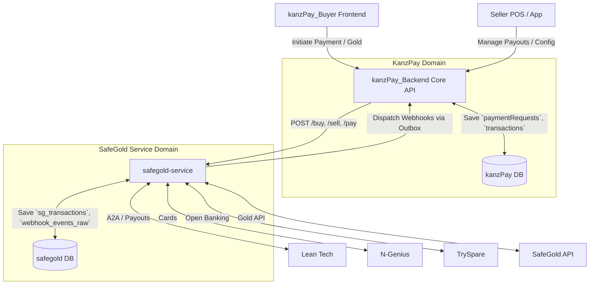
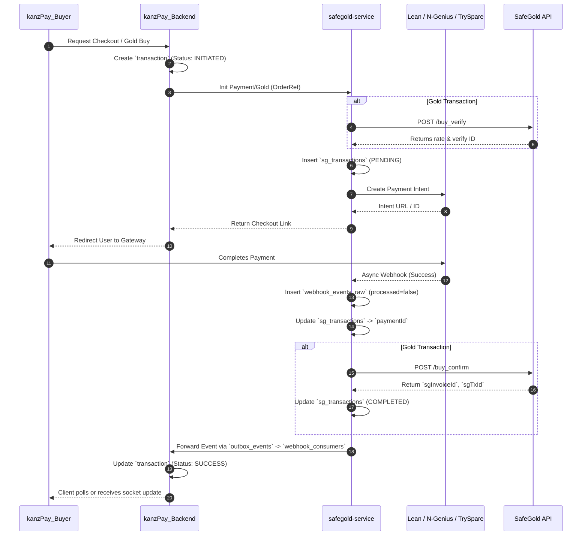

# KanzPay & SafeGold Microservice Architecture

This document outlines the payment and gold architecture across the **kanzPay_Backend**, **kanzPay_Buyer**, and the dedicated **safegold-service**.

## 1. System Architecture & Data Flow

The architecture is highly decoupled. **KanzPay Backend** manages core business logic (orders, commissions, seller POS), while the **SafeGold Service** acts as a unified Payment & Gold microservice. It manages integrations with SafeGold, Lean, N-Genius, and TrySpare, returning standardized webhook events to consuming apps.

## 2. Detailed Payment & Gold Flow

The payment and gold flows rely heavily on **Idempotency** and **Asynchronous Webhooks** (Zero-Trust callbacks).

## 3. Database Keys & Data Fields Kept

We retain specific data fields at the microservice level to separate external vendor constraints from our core domain logic.

### A. kanzPay_Backend Data (Core Ledger)
**Table: `transactions`**
* `paymentRequestId`: Links to the core KanzPay checkout session.
* `pspTransactionId`: The provider's master transaction ID (Lean/NGenius/TrySpare ID).
* `grossAmount`, `commissionAmount`, `netAmount`: Precise financial splits for KanzPay rules.
* `status`: e.g., `INITIATED`, `SUCCESS`.
* `pspRawPayload`, `webhookPayload`: Stored as raw `jsonb` for auditability.

**Table: `users`**
* `id`, `phone`, `email`: Our universal user identifiers. No payment-provider-specific IDs are kept here to prevent vendor lock-in.

### B. safegold-service Data (Gateway & Gold Orchestrator)

**Table: `sg_users` (Gold & Payout Profiles)**
* `appUserId`, `appSource`: Links the profile back to `kanzPay_Backend`.
* `sgIdentityNumber`: Unique SafeGold KYC identifier.
* `goldBalance`, `sellableBalance`, `investedValue`: Kept at 8 decimal precision.
* `leanCustomerId`, `leanDestinationId`: Used for A2A open-banking payouts.

**Table: `sg_transactions` (The Universal Ledger)**
This table maps Gateway payments to Gold executions.
* **Gateway Fields:**
  * `provider`: `lean` | `ngenius` | `tryspare`
  * `paymentIntentId`: Session ID during checkout (e.g., Lean Intent).
  * `paymentId`: The final completed gateway ID.
  * `payoutId`, `payoutStatus`: For merchant/user withdrawals.
  * `providerOrderRef`, `providerPaymentRef`: Standardized references.
* **SafeGold Fields:**
  * `type`: `BUY` | `SELL`
  * `status`: e.g., `PENDING`, `PENDING_PAYOUT`, `COMPLETED`, `COMPLETED_BULK`, `KYC_NOT_VERIFIED`.
  * `sgTxId`, `sgInvoiceId`, `sgInvoiceLink`: SafeGold return data.
  * `goldAmount`: Precision (18, 8).
  * `aedAmountMinor`: Strict storage of fiat in minor units (fils) to prevent float math errors.
  * `rate`, `rateId`, `transactionValidity`: SafeGold locking mechanics.

**Table: `webhook_events_raw` (Audit & Idempotency)**
* `provider`: Explicit enum mapping to `"lean" | "ngenius" | "safegold" | "tryspare"`.
* `eventId`: Vendor's unique event ID to prevent double processing.
* `payload`, `headers`: Raw JSON for replayability.
* `processed`: Boolean flag for worker queues.

**Table: `verified_bank_accounts` (KYC'd Destinations)**
* `provider`: (e.g., Lean).
* `customerId`, `destinationId`: Verified IBAN/Account destinations.

## 4. Key Architectural Decisions

1. **Adapter Pattern (Safegold-Service)**: The core backend does not know if a payment is handled by Lean or TrySpare. It sends an amount and order reference to the `safegold-service`, which acts as the Payment Gateway Resolver.
2. **Idempotency & Auditing**: Every webhook from Lean, N-Genius, or TrySpare is dumped into `webhook_events_raw` and processed asynchronously.
3. **Financial Math**: `aedAmountMinor` uses integers (fils) across both KanzPay and SafeGold domains, while gold balances use deep numeric precision (18,8).
